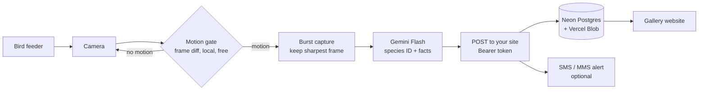

# BirdWatcher

**An AI bird-feeder camera you build yourself.** Point a camera at a feeder, and
a small always-on computer watches for motion, snaps a burst when something shows
up, identifies the species with Google Gemini, and posts the sharpest photo plus a
couple of fun facts to your own public gallery website. Squirrels, foxes, and the
neighbor's cat get their own "critter" gallery.

You end up with a live page — at a domain you own — that fills itself with the
birds visiting your yard, keeps a running life list of every species you've seen,
and lets visitors press a button to make the camera take a photo right now. It
runs on free tiers and costs roughly **$0–2/month**.

<!-- TODO: add 2-3 gallery screenshots here -->

## How it works



A camera-side service (in `camera/`) watches the video for movement using plain
frame-differencing — no cloud calls, no cost — so the expensive part only runs
when something actually arrives. When motion trips the gate, it grabs a short
burst and keeps the least-blurry frame. That single photo goes to Gemini Flash,
which returns the species and a few fun facts (with a stronger model re-checking
anything rare, so you don't get confident nonsense). The service then POSTs the
photo and the identification to your website's ingest endpoint, authenticated with
a shared token. From there the site stores the image, updates your life list and
daily activity log, and — if you've turned it on — texts you a photo of the
visitor. Non-birds are sorted into a separate critter gallery instead.

## Features

- **Local motion detection**, free and offline — two modes: whole-frame (good for
  feeder close-ups) and localized-tile (good for wide yard shots).
- **Burst-and-pick-sharpest** capture so you keep the crisp frame, not the blur.
- **Gemini species ID + fun facts** on every sighting.
- **Hallucination guard** — a stronger verify model re-checks rare species before
  they hit your gallery.
- **Species priors that learn** — the model is nudged by your feeder's most common
  birds, your own admin corrections, and (optionally) free eBird seasonal data.
- **Critter gallery** for squirrels, foxes, deer, people, and other non-birds.
- **Daily activity log** — a calendar of who visited and how often.
- **"Take a photo now" button** — visitors press it (PIN-gated) and the camera
  takes a live shot.
- **SMS / MMS alerts** via Twilio, with a separate opt-in for critter alerts.
- **Admin corrections** — fix a species from the site and the facts regenerate.
- **Spend tracking page** so you can watch your (tiny) Gemini bill.
- **Multi-camera support** — run several cameras into one gallery.
- **Weekly auto-archiving** of older photos.

## What you'll need

### A computer to run the camera on

| Path | Cost | Good for | Tradeoffs |
| --- | --- | --- | --- |
| **Raspberry Pi Zero 2 W** | ~$15 | The budget minimum; sips power | Slower; one camera at a time; fine for a single feeder |
| **Raspberry Pi 4 / Pi 5** | ~$35–80 | **Recommended.** Headroom for bursts, multi-camera, snappy | Costs a bit more |
| **Mac mini / any always-on computer** | already own it | No new hardware | **RTSP camera only** — the Pi Camera Module needs a Pi |

### A camera

| Path | What it is | Good for | Notes |
| --- | --- | --- | --- |
| **Raspberry Pi Camera Module 3** | CSI ribbon camera, autofocus | Sharp feeder close-ups; cheapest | Pi only; wired to the Pi. We walk you through it. |
| **Reolink (or any RTSP camera)** | Wi-Fi network camera | Weatherproof, place it anywhere | Works on a Pi *or* a Mac mini via OpenCV |
| **Both at once** | one of each | A close feeder cam + a wide yard cam | Uses multi-camera mode |

### Accounts (all have free tiers)

- **[Vercel](https://vercel.com)** — hosts the website + serverless API. Free tier
  covers a household.
- **[Neon](https://neon.tech)** — Postgres for sighting metadata. Free tier is plenty.
- **[Vercel Blob](https://vercel.com/storage/blob)** — stores the photos. Added to
  your Vercel project; free tier covers a household.
- **[Google AI Studio](https://aistudio.google.com/apikey)** — free Gemini API key.
- **A domain you own** (or are ready to buy) for the gallery, e.g. `your-domain.example`.

Optional: **[eBird API key](https://ebird.org/api/keygen)** (free, for seasonal
species priors) · **[Twilio](https://www.twilio.com)** (SMS/MMS alerts) ·
**[healthchecks.io](https://healthchecks.io)** (uptime pings) ·
**[Tailscale](https://tailscale.com)** (private remote access to the Pi).

## What it costs

Honest numbers:

- **Running cost: ~$0–2/month.** Vercel, Neon, and Blob free tiers cover a normal
  household. Because the local motion gate runs before any API call, Gemini only
  fires on real visitors — pennies a month at ~$0.0006 per identification.
- **Hardware: ~$50–150 one time**, depending on your path. A Pi Zero 2 W + Pi
  Camera Module lands near the bottom; a Pi 5 + a weatherproof Reolink lands near
  the top. If you run the camera on a computer you already own with an RTSP camera,
  it's just the camera.

## Quick start

You can see the whole website running in about a minute, with sample birds, before
you buy anything.

```bash
git clone https://github.com/wstoeckle/birdwatcher-public.git
cd birdwatcher-public
npm install
npm run dev
```

Open the URL it prints. With no environment variables set, the site serves
built-in sample sightings — this is the gallery you're building toward.

When you're ready to build the real thing, follow **[docs/GETTING_STARTED.md](docs/GETTING_STARTED.md)**.
The order that works best:

1. **Cloud first.** Create the Vercel project, add Neon + Blob, set a few env vars,
   run the files in `migrations/` against your database, and point your domain at it.
   Now you have a live (empty) gallery.
2. **Camera second.** Set up the Pi (or your always-on computer), wire up a camera,
   drop in your Gemini key and ingest token, and start the service. See
   **[camera/SETUP.md](camera/SETUP.md)** for the full walkthrough and
   **[docs/HARDWARE.md](docs/HARDWARE.md)** to pick parts.

Smoke-test the camera code with no hardware at all:

```bash
python3 camera/birdcam.py --test-image photo.jpg
```

## Repo layout

| Path | What's in it |
| --- | --- |
| `src/` | Vite + React gallery — photo cards, species life list, activity calendar, critter page, SMS signup, full-screen modal |
| `api/` | Vercel serverless functions — ingest, gallery queries, activity rollups, capture queue, admin corrections, alerts, spend |
| `camera/` | The camera-side Python service (`birdcam.py`, `birdcam_multi.py`) + systemd units, install script, and `SETUP.md` |
| `migrations/` | Nine numbered `.sql` files — run by hand with `psql` against Neon |
| `sites/` | Per-household **non-secret** config registry; start from `sites/example/site.toml` |
| `docs/` | Setup, hardware, remote-access, API contract, and troubleshooting guides |

## Maintaining it from your couch

The camera lives outside, wired to a tiny computer you'll rarely touch. The nicest
way to keep it healthy is to **install [Tailscale](https://tailscale.com) and
[Claude Code](https://claude.com/claude-code) (or the Codex CLI) directly on the
Pi.** Then, instead of debugging outdoors with a keyboard, you SSH in from the
couch (`ssh pi@birdcam`, from any network) and just *tell the agent what's wrong* — "the night
shots are blurry," "add my new feeder camera" — and let it fix things in place.

See **[docs/REMOTE_ACCESS.md](docs/REMOTE_ACCESS.md)** for the setup.

## Docs

| Doc | What it covers |
| --- | --- |
| [docs/GETTING_STARTED.md](docs/GETTING_STARTED.md) | The end-to-end build: cloud first, then camera |
| [docs/HARDWARE.md](docs/HARDWARE.md) | Choosing a computer and a camera; parts lists |
| [camera/SETUP.md](camera/SETUP.md) | Setting up the Pi and the camera service |
| [docs/REMOTE_ACCESS.md](docs/REMOTE_ACCESS.md) | Tailscale + an on-device agent for hands-off upkeep |
| [docs/API.md](docs/API.md) | The camera ↔ website contract (ingest + queries) |
| [docs/NOTIFICATIONS.md](docs/NOTIFICATIONS.md) | Twilio SMS/MMS alert setup |
| [docs/FOCUS_DEBUG.md](docs/FOCUS_DEBUG.md) | Diagnosing and fixing soft-focus photos |

## License

MIT — see [LICENSE](LICENSE).
